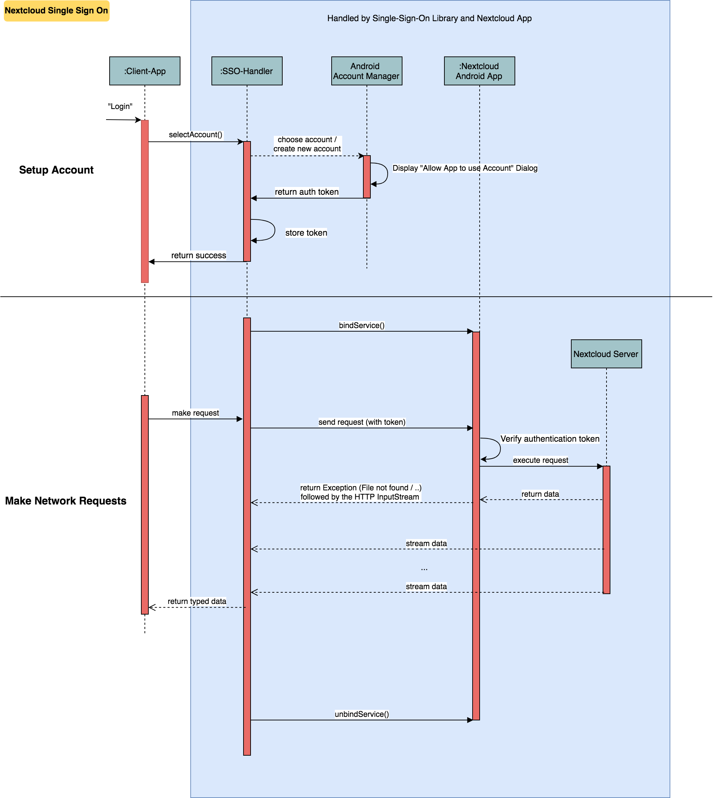

Nextcloud Single Sign On
=========================

This library allows you to use the network stack provided by the nextcloud app. Therefore you don't need to ask for the users credentials anymore as well as you don't need to worry about self-signed ssl certificates, two factor authentication, etc.


How to use it?
--------------

1) Add this library to your project

```gradle
dependencies {
    implementation "com.github.nextcloud:android-SingleSignOn:sso-SNAPSHOT"
}
```
2) Add the following permission to your `AndroidManifest.xml` 

```xml
<uses-permission android:name="com.owncloud.android.sso"/>
```

3) To choose an account, include the following code in your login dialog:

```java
final int CHOOSE_ACCOUNT = 12;

private void showAccountChooserLogin() {
    Intent intent = AccountManager.newChooseAccountIntent(null, null, new String[] {"nextcloud"}, true, null, null, null, null);
    startActivityForResult(intent, CHOOSE_ACCOUNT);
}

@Override
public void onActivityResult(int requestCode, int resultCode, Intent data) {
    super.onActivityResult(requestCode, resultCode, data);

    if (resultCode == RESULT_OK) {
        if (requestCode == CHOOSE_ACCOUNT) {
            String accountName =  data.getStringExtra(AccountManager.KEY_ACCOUNT_NAME);
            Account account = AccountImporter.GetAccountForName(getActivity(), accountName);
            if(account != null) {
                AccountImporter.SetCurrentAccount(getActivity(), account);
            }
        }
    }
}

// Hint: Checkout the LoginDialogFragment.java from the nextcloud-news app (sso-branch) to see a fully working example
```

3) How to get account information?

```java
Account account = AccountImporter.GetCurrentAccount(getActivity());
SingleSignOnAccount ssoAccount = AccountImporter.GetAuthTokenInSeparateThread(getActivity(), account);

// ssoAccount.name // Name of the account used in the android account manager
// ssoAccount.username
// ssoAccount.token 
// ssoAccount.url 
```

4) How to make a network request?

4.1.1) Retrofit: 

If you have an interface such as the following: 

```java
public interface API {
    
    @GET("user")
    Observable<UserInfo> user();

    @GET("status")
    Observable<NextcloudStatus> status();

    @GET("version")
    Observable<NextcloudNewsVersion> version();

    …
}
```

Typical use of API using Retrofit
```java
public class ApiProvider {

    private API mApi;

    public ApiProvider() {
        mApi = retrofit.create(API.class);
    } 
}
```

4.1.2) Use Nextcloud network stack:

You can implement that interface and use the nextcloud network stack instead of the retrofit one.

```java
public class API_SSO implements API {

    private static final String mApiEndpoint = "/index.php/apps/news/api/v1-2/";
    private NextcloudAPI nextcloudAPI;

    public API_SSO(NextcloudAPI nextcloudAPI) {
        this.nextcloudAPI = nextcloudAPI;
    }

    @Override
    public Observable<UserInfo> user() {
        final Type type = UserInfo.class;
        NextcloudRequest request = new NextcloudRequest.Builder()
                .setMethod("GET")
                .setUrl(mApiEndpoint + "user")
                .build();
        return nextcloudAPI.performRequestObservable(type, request);
    }

    @Override
    public Observable<NextcloudStatus> status() {
        Type type = NextcloudStatus.class;
        NextcloudRequest request = new NextcloudRequest.Builder()
                .setMethod("GET")
                .setUrl(mApiEndpoint + "status")
                .build();
        return nextcloudAPI.performRequestObservable(type, request);
    }

    @Override
    public Observable<NextcloudNewsVersion> version() {
        Type type = NextcloudNewsVersion.class;
        NextcloudRequest request = new NextcloudRequest.Builder()
                .setMethod("GET")
                .setUrl(mApiEndpoint + "version")
                .build();
        return nextcloudAPI.performRequestObservable(type, request);
    }

    …
}
```

4.1.3) Use of new API using the nextcloud app network stack

```java
public class ApiProvider {

    private API mApi;

    public ApiProvider(NextcloudAPI.ApiConnectedListener callback) {
        SingleSignOnAccount ssoAccount = 
            AccountImporter.GetAuthTokenInSeparateThread(context, account);
        NextcloudAPI nextcloudAPI = new NextcloudAPI(ssoAccount, GsonConfig.GetGson());
        nextcloudAPI.start(context, callback);
        mApi = new API_SSO(nextcloudAPI);
    } 
}
```
Enjoy! If you're already using retrofit, you don't need to modify your application logic. Just exchange the API and you're good to go!

4.2) Without Retrofit

NextcloudAPI provides a method called `performNetworkRequest(NextcloudRequest request)` that allows you to handle the server response yourself.

```java
// create nextcloudAPI instance
SingleSignOnAccount ssoAccount = AccountImporter.GetAuthTokenInSeparateThread(context, account);
NextcloudAPI nextcloudAPI = new NextcloudAPI(ssoAccount, GsonConfig.GetGson());

private void downloadFile() {
    NextcloudRequest nextcloudRequest = new NextcloudRequest.Builder()
            .setMethod("GET")
            .setUrl("/remote.php/webdav/sample.mp4")
            .build();

    try {
        InputStream inputStream = nextcloudAPI.performNetworkRequest(nextcloudRequest);
        while(inputStream.available() > 0) {
            inputStream.read();
            // TODO do something useful with the data here..
            // like writing it to a file..?
        }
        inputStream.close();
    } catch (Exception e) {
        e.printStackTrace();
    }
}
```

# Flow Diagram

Note that the "Make network request" section in the diagram only shows the workflow if you use the "retrofit" api. 

